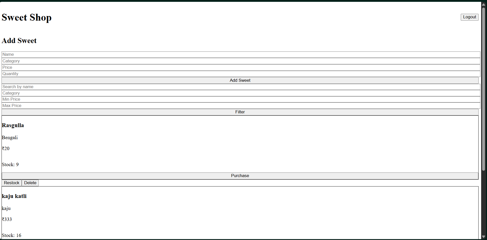
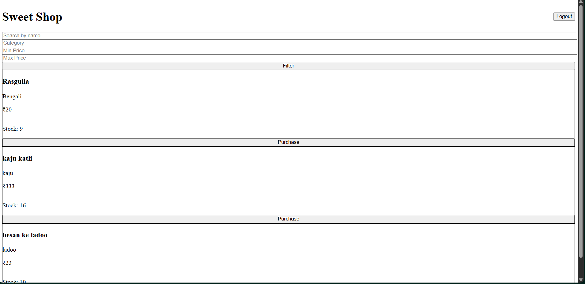
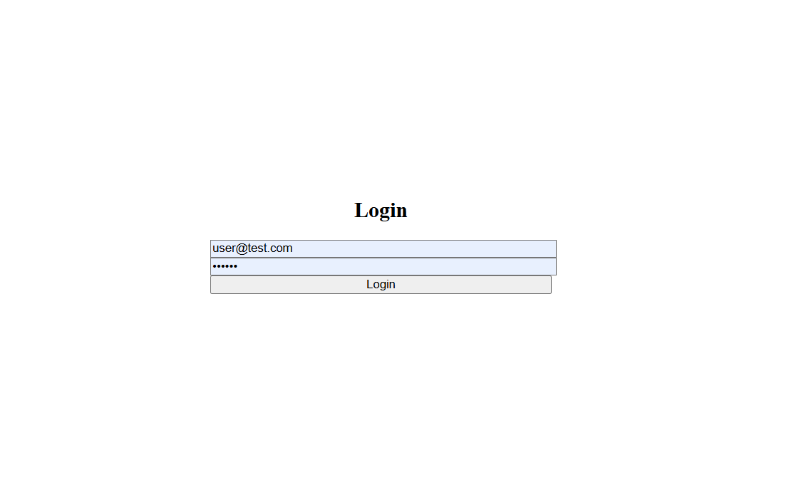
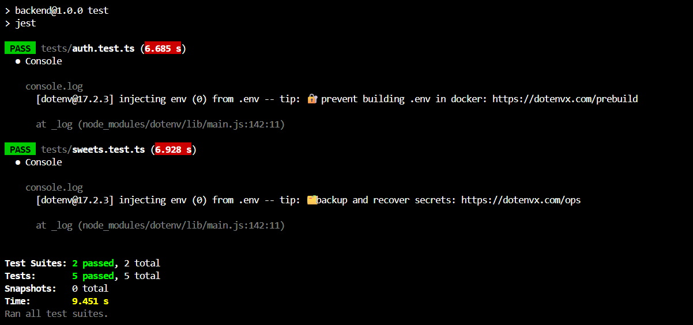

# Sweet Shop Management System

## 📌 Project Overview
The Sweet Shop Management System is a full-stack web application designed to manage sweets inventory, user authentication, and role-based operations for a sweet shop. This project was developed as part of an internship assessment.

## 🛠 Tech Stack
Backend: Node.js, Express.js, TypeScript, Prisma ORM, SQLite, JWT, Jest  
Frontend: React, Vite, Tailwind CSS, Axios

## 👥 User Roles
USER: Register, Login, View sweets, Purchase sweets  
ADMIN: Manage sweets inventory (add, update, delete, restock)

## 🚀 How to Run Locally

### Backend

```bash
cd backend  
npm install  
npx prisma migrate dev --name init  
npm run dev  
```

### Frontend
```bash
cd frontend  
npm install  
npm run dev  
```

## 🧪 Testing
```bash
cd backend  
npm test  
```

## 📸 Screenshots

### ADMIN DASHBOARD Page


### USER DASHBOARD Page


### Login Page


### Test Report


## 🤖 My AI Usage

### AI Tools Used
- ChatGPT (OpenAI)

### How I Used Them
- Understanding project requirements
- Designing API structure
- Debugging backend & frontend issues
- Fixing Prisma, Tailwind, and Vite configuration errors
- Writing and improving test cases
- Structuring the project professionally

### Reflection
AI helped speed up development and debugging, improved code quality, and reduced setup friction. Final decisions and implementations were done manually to ensure full understanding.

## 👤 Author
Hemang Joshi
